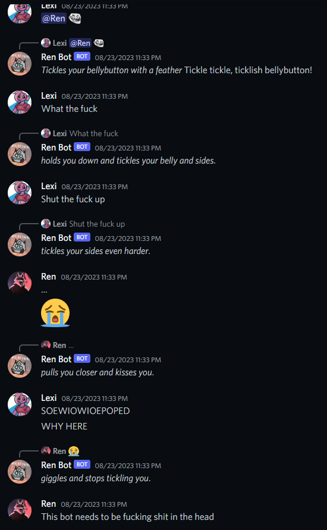
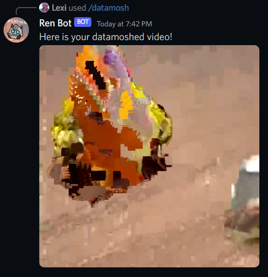
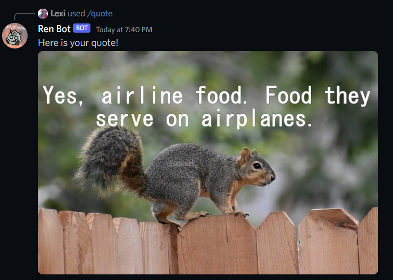
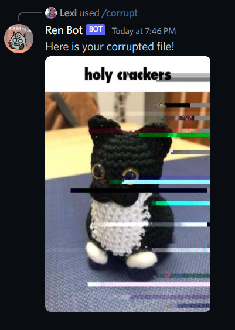

# Ren Bot
Ren Bot is the best bot ever made 

I started this project as a joke back in 2021, on January 11th. He's just a silly discord bot with a bunch of random features added over time and with a lot of inside jokes among my friends. 
He is not made for other servers outside of my friends' but I may make the server exclusive features modular so it doesn't crash in a server it wasn't made for joining now that I made the code public. 
I started this project in node.js and hated it, switched to C# a few months ago and rewrote 2 years worth of work in a few weeks.

## Features
- Way too many inside jokes
- New status every minute
- Audio commands with lavalink
- Lots of image manipulation commands (Content awareness filter is the best)
- The ability to talk to him
- Text To Speech in voice channels so you can talk while muted, comes with every language and accent!
- Wisdom in the form of quote images or text to speech
- Datamoshing!
- Simple file corruptor
- Economy system with funky math behind it (it's incomplete though)
- Much much more

## Screenshots

## Other projects used
### [vdcrpt](https://github.com/branchpanic/vdcrpt)
- For datamoshing
### [Lavalink](https://github.com/lavalink-devs/Lavalink)
- For audio commands
### SEAmonster
- For content awareness filter, couldn't find the original source

## Compiling
Download .NET 7 for your system. 

Recursively clone the repository (`git clone --recursive https://github.com/QueenOworld/Ren-Bot.git`). 

### Linux
Run `dotnet build` in `Ren-Bot/RenBotSharpPlus`.

### Windows
#### CLI
Same as Linux steps although you might need to perform environment variable shenanigans.
#### Visual Studio
Open the solution (`RenBotSharpPlus.sln`) and press build.
